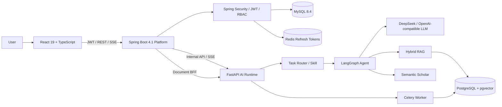

# EduAgent Hub

> 面向实验室知识管理与科研论文阅读的 **Java + Python 双运行时 Enterprise Agent Platform**。
>
> 当前稳定版本：**V2.2.0**；下一阶段：**V2.3 Document Lifecycle / MinIO / RabbitMQ**。

GitHub: https://github.com/jmhngnl/EduAgent-Hub

---

## 1. 项目定位

EduAgent Hub 不是一个只调用大模型 API 的聊天 Demo，而是一个围绕科研工作场景构建的 AI 应用平台，核心覆盖：

- LangGraph Agent orchestration；
- Task Router / Skill Routing；
- Tool Calling；
- 实验室知识 RAG；
- 论文 PDF 入库、阅读与检索；
- SSE 流式回答与 Agent Trace；
- Conversation / ChatMessage 持久化；
- Document Center；
- Java Platform BFF；
- V2.2 User / JWT / Workspace / RBAC。

当前主要场景：

```text
实验室知识
├── GPU / 算力申请
├── 服务器 / DBCloud
├── 实验室制度与流程
└── 数据合规 / 脱敏

科研论文
├── PDF 上传与异步解析
├── 论文背景 / 方法 / 创新点
├── 数据集 / baseline / 指标
├── 消融实验 / 局限
└── Semantic Scholar 检索与推荐
```

---

## 2. 当前总体架构

EduAgent Hub 从 V2.1 开始采用明确的双运行时边界：

```text
React / TypeScript
       │
       │ JWT + REST / SSE
       ▼
Spring Boot Platform
       │
       ├── User / JWT / Workspace / Membership / RBAC
       ├── Conversation / ChatMessage
       ├── Document BFF
       ├── MySQL
       └── Redis Refresh Token
       │
       │ Internal API / SSE
       ▼
FastAPI AI Runtime
       │
       ├── LangGraph
       ├── Task Router / Skill
       ├── Tool Calling
       ├── DeepSeek / OpenAI-compatible LLM
       ├── RAG / Embedding
       ├── PDF Parsing
       └── Celery
       │
       ▼
PostgreSQL + pgvector
```



### 职责原则

```text
Java = deterministic business / enterprise platform
Python = non-deterministic Agent / AI runtime
```

因此：

- User、JWT、Workspace、Membership、RBAC 放在 Java；
- LangGraph、LLM、Skill、Tool、RAG、Embedding、PDF 解析放在 Python；
- 浏览器不直接持有 Python Runtime 的内部访问密钥；
- Python 不成为第二套 JWT 权限中心。

---

## 3. V2.1 已完成能力

V2.1 已将 V1 Agent/RAG 原型升级为可持续使用的平台基础。

| 能力 | 状态 |
|---|---|
| React Conversation UI | ✅ |
| History Sidebar | ✅ |
| MySQL Conversation / ChatMessage | ✅ |
| 刷新后历史恢复 | ✅ |
| Java → FastAPI SSE Proxy | ✅ |
| Route / Skill / Tool / Citation Trace | ✅ |
| Assistant Trace 持久化 | ✅ |
| Document Center | ✅ |
| PDF / TXT / Markdown 上传 | ✅ |
| 文本知识入库 | ✅ |
| Celery 异步索引状态 | ✅ |
| Java Document BFF | ✅ |
| Hybrid RAG | ✅ |
| Paper Reader | ✅ |
| Lab Resource Skill | ✅ |

V2.1 数据主链路：

```text
Browser
  ↓
Nginx / React
  ↓
Spring Boot Platform
  ↓
FastAPI / LangGraph
  ↓
LLM / Tool / RAG
```

---

## 4. V2.2 Identity / Workspace / RBAC

V2.2 已将真实身份与权限边界放入 Java Platform。

### 4.1 身份模型

```text
app_user
workspace
workspace_member
```

Access Token：

```text
JWT
默认 30 分钟
Authorization: Bearer <token>
```

Refresh Token：

```text
随机 opaque token
↓
SHA-256 key
↓
Redis DB 3
↓
HttpOnly + SameSite=Strict Cookie
```

Refresh Token 采用 rotation：旧 token 被消费后立即失效，再签发新 token。

### 4.2 Workspace 角色

```text
OWNER
ADMIN
MEMBER
VIEWER
```

权限矩阵：

| 操作 | OWNER | ADMIN | MEMBER | VIEWER |
|---|---:|---:|---:|---:|
| Chat / RAG 查询 | ✅ | ✅ | ✅ | ✅ |
| 创建个人 Conversation | ✅ | ✅ | ✅ | ✅ |
| 上传 / 写知识库 | ✅ | ✅ | ✅ | ❌ |
| 管理 MEMBER / VIEWER | ✅ | ✅ | ❌ | ❌ |
| 授予 / 管理 ADMIN | ✅ | ❌ | ❌ | ❌ |

Ownership transfer 暂不在 V2.2 实现。

### 4.3 Workspace 请求边界

业务请求使用：

```text
Authorization: Bearer <JWT>
X-Workspace-Id: <workspace-id>
```

Java 会执行：

```text
JWT userId
  ↓
workspace_member
  ↓
role check
  ↓
verified workspaceId
  ↓
Business Service / Python Runtime
```

浏览器提交的 workspace 值不会直接成为可信权限来源。

### 4.4 V2.1 历史兼容

V2.2 Flyway migration 创建：

```text
app_user
workspace
workspace_member
```

并保留现有 `demo` workspace。

第一个 Bootstrap User 或第一个注册用户成为 `demo` 的 OWNER，并认领 V2.1 遗留会话：

```sql
conversation.user_id IS NULL
AND workspace_id = 'demo'
```

因此已有 Conversation 不需要重建。

### 4.5 MyBatis Mapper 注册边界

V2.2 的 Java Platform 同时扫描三个业务 Mapper package：

```java
@MapperScan({
    "com.eduagent.platform.conversation",
    "com.eduagent.platform.identity",
    "com.eduagent.platform.workspace"
})
```

这样 `ConversationMapper`、`AppUserMapper`、`WorkspaceMapper` 和
`WorkspaceMemberMapper` 都由 MyBatis 注册为 Spring Bean。

---

## 5. Agent 与 Tool 系统

### Task Router

当前任务类型：

```text
lab_resource
paper_reading
general
```

### Skills

```text
skills/paper-reader/SKILL.md
skills/lab-resource/SKILL.md
```

### Tool Registry

```text
search_knowledge
search_academic_papers
read_paper_evidence
safe_calculator
```

#### `search_knowledge`

面向实验室知识：

```text
document_type = lab_document
```

#### `read_paper_evidence`

针对已上传论文执行定向证据查询：

```text
背景 / motivation
方法 / architecture / loss
数据集 / baseline / metrics / results
ablation / limitations / conclusion
```

限定：

```text
document_type = paper
```

#### `search_academic_papers`

通过 Semantic Scholar 做论文发现与相关工作搜索。

#### `safe_calculator`

基于 AST 的受限算术表达式计算，不执行 Python `eval()`。

---

## 6. Agent Trace 与 SSE

Python Runtime 输出：

```text
route
tool_start
token
tool_end
done
error
```

Spring Boot 代理 SSE，并在 `done` 前完成 Assistant Message 持久化。

持久化字段包括：

```text
task_route
skill_name
tool_calls_json
citations_json
token_usage_json
latency_ms
```

因此刷新页面后仍可恢复 Route / Skill / Tool / Sources。

---

## 7. Conversation Persistence

MySQL 是完整历史对话 Source of Truth：

```text
conversation
chat_message
```

Redis 不是永久聊天历史数据库；它继续承担短期运行态与缓存职责。

V2.2 后 Conversation 同时受：

```text
user_id
+
workspace_id
```

约束，用户只能访问自己在当前 Workspace 下的 Conversation。

---

## 8. Document Center

Web UI 提供独立 Documents 模块。

支持：

```text
PDF
TXT
Markdown
手工文本
```

类型：

```text
lab_document
paper
```

能力：

```text
文件上传
文本入库
Celery Task 状态
文档列表
chunk count
知识检索验证
```

V2.2 RBAC：

```text
VIEWER  → 只读
MEMBER+ → 可上传 / 写入
```

Agent 主动写知识库暂缓，等待后续 HITL / Audit / Agent Governance。

---

## 9. Hybrid RAG

当前检索不是单一向量搜索，而是：

```text
pgvector cosine recall
+
PostgreSQL FTS
+
pg_trgm
+
Reciprocal Rank Fusion
```

返回字段：

```text
document_id
source
chunk_id
score
content
metadata
```

---

## 10. PDF 异步入库

流程：

```text
React
  ↓
Spring Boot Document BFF
  ↓
FastAPI
  ↓
shared uploads volume
  ↓
Celery + Redis
  ↓
pypdf / text parser
  ↓
text sanitization
  ↓
RecursiveCharacterTextSplitter
  ↓
Embedding
  ↓
PostgreSQL + pgvector
```

API 与 Worker 共享：

```text
uploads:/tmp/eduagent_uploads
```

PDF 提取文本中的 `\x00` 会在 Knowledge Store 持久化边界统一清洗，避免 PostgreSQL UTF-8 写入异常。

---

## 11. 技术栈

### Platform / Business

```text
Java 21
Spring Boot 4.1.1
Spring Security
MyBatis-Plus 3.5.x
Flyway
MySQL 8.4
Redis
Auth0 java-jwt
```

### AI Runtime

```text
Python 3.12
FastAPI
LangGraph
LangChain
DeepSeek / OpenAI-compatible LLM
Semantic Scholar
pypdf
Celery
```

### Data / Retrieval

```text
PostgreSQL 17
pgvector
PostgreSQL FTS
pg_trgm
RRF
```

### Frontend

```text
React 19
TypeScript
Vite
TanStack Query
Zustand
react-markdown
Nginx
SSE
```

### Engineering

```text
Docker / Docker Compose
pytest
GitHub Actions
Prometheus
OpenTelemetry
MCP
```

---

## 12. 项目目录

```text
EduAgent-Hub/
├── app/                         # Python AI Runtime
│   ├── agent.py
│   ├── config.py
│   ├── llm.py
│   ├── main.py
│   ├── mcp_server.py
│   ├── rag.py
│   ├── schemas.py
│   ├── tasks.py
│   ├── skills/
│   └── tools/
│
├── platform-server/             # Java Platform
│   └── src/main/java/com/eduagent/platform/
│       ├── agent/
│       ├── auth/
│       ├── conversation/
│       ├── identity/
│       ├── knowledge/
│       └── workspace/
│
├── frontend/                    # React Product UI
│   └── src/
│       ├── api/
│       ├── auth/
│       ├── components/
│       ├── store/
│       └── App.tsx
│
├── skills/
├── migrations/                  # PostgreSQL / pgvector
├── docs/
├── scripts/
├── tests/
├── docker-compose.yml
└── README.md
```

---

## 13. 快速启动

### 13.1 环境文件

DeepSeek：

```bash
cp .env.deepseek.example .env
```

或者：

```bash
cp .env.example .env
```

V2.2 必须关注以下 Secret：

```env
PLATFORM_INTERNAL_API_KEY=<long-random-internal-runtime-key>
PLATFORM_JWT_SECRET=<at-least-32-random-characters>

# 可选：确定性创建第一个 demo OWNER
PLATFORM_BOOTSTRAP_USERNAME=
PLATFORM_BOOTSTRAP_PASSWORD=
PLATFORM_BOOTSTRAP_DISPLAY_NAME=Platform Owner
```

模型 Secret：

```env
LLM_API_KEY=<provider-secret>
```

**不要把真实 Secret 提交到 Git。**

生产 HTTPS 环境应设置：

```env
PLATFORM_REFRESH_COOKIE_SECURE=true
```

### 13.2 Docker Compose

```bash
docker compose up -d --build
```

访问：

```text
Web UI       http://localhost:5173
Java API     http://localhost:8081
FastAPI      http://127.0.0.1:8000
```

V2.2 中 FastAPI 默认只绑定到宿主机 loopback；浏览器业务流量应经过 Java Platform。

### 13.3 V2.2 部署脚本

```bash
chmod +x scripts/redeploy-v2.2.sh
./scripts/redeploy-v2.2.sh
```

随后执行：

```bash
./scripts/smoke-v2.2.sh
```

Smoke Test 验证：

```text
注册
Workspace 创建
Conversation 身份隔离
OWNER 添加 VIEWER
VIEWER 读取知识库
VIEWER 写知识库被 403 拒绝
Refresh Token rotation
```

---

## 14. V2.2 Platform API

### Authentication

```http
POST /api/auth/register
POST /api/auth/login
POST /api/auth/refresh
POST /api/auth/logout
GET  /api/auth/me
```

### Workspace

```http
GET    /api/workspaces
POST   /api/workspaces
GET    /api/workspaces/{workspaceId}/members
PUT    /api/workspaces/{workspaceId}/members
DELETE /api/workspaces/{workspaceId}/members/{userId}
```

### Conversation

```http
POST   /api/conversations
GET    /api/conversations
GET    /api/conversations/{id}
GET    /api/conversations/{id}/messages
POST   /api/conversations/{id}/messages/stream
DELETE /api/conversations/{id}
```

### Knowledge / Documents

```http
GET  /api/documents
POST /api/documents/upload
POST /api/documents/text
GET  /api/document-tasks/{taskId}
GET  /api/knowledge/search
```

---

## 15. Python Runtime API

Python 仍保留内部 AI API：

```http
POST /v1/chat
POST /v1/chat/stream
POST /v1/knowledge/text
POST /v1/knowledge/files
GET  /v1/knowledge/documents
GET  /v1/knowledge/search
GET  /v1/tasks/{task_id}
```

这些 API 由 Java BFF 使用内部 service key 访问，不应作为浏览器业务鉴权层。

---

## 16. 安全边界

请勿提交：

```text
.env
真实 LLM_API_KEY
真实 PLATFORM_INTERNAL_API_KEY
真实 PLATFORM_JWT_SECRET
*.patch
*.diff
本地 PDF
根目录 tar.gz / tgz 部署包
```

仓库 `.gitignore` 会忽略：

```text
.env
*.patch
*.diff
*.rej
*.orig
/*.pdf
/*.tar.gz
/*.tgz
```

V2.2 的安全原则：

```text
浏览器 JWT → Java
Java Membership / RBAC → 权限决策
Java Internal Key → Python
Python → 不解析浏览器 JWT
```

---

## 17. V2.2 Release 验收

V2.2 的发布验收重点：

```text
Spring Boot / Flyway V2 正常启动
Bootstrap Owner 可登录并认领 V2.1 历史 Conversation
JWT Access Token 可访问受保护 API
Refresh Token 在 Redis 中轮换
Workspace Membership 隔离生效
VIEWER 可读但不可写知识库
MEMBER / ADMIN / OWNER 按角色执行写操作
Frontend → Spring Boot → FastAPI 链路正常
FastAPI 默认仅绑定宿主机 loopback
```

仓库提供：

```bash
./scripts/smoke-v2.2.sh
```

用于覆盖注册、Workspace、RBAC 与 Refresh Token 的核心回归。

---

## 18. 当前版本状态

```text
V1 Agent / RAG Core                         ✅
V2.1 Conversation Workspace                ✅
V2.1 React History / SSE / Trace            ✅
V2.1 Document Center / Java BFF             ✅

V2.2 User / Spring Security / JWT            ✅
V2.2 Redis rotating Refresh Token            ✅
V2.2 Workspace / Membership / RBAC           ✅
V2.2 Python Runtime internalization          ✅

Document Lifecycle / MinIO / RabbitMQ        ⏳
Agent write tools / HITL / Audit              ⏳
LangGraph Postgres Checkpointer               ⏳
Reranker / Eval                               ⏳
```

---

## 19. Roadmap

```text
V2.1 ✅
Conversation / ChatMessage
React History
Java SSE Proxy
Document Center
Java Document BFF

V2.2 ✅
User
Spring Security
JWT
Redis Refresh Token
Workspace
Membership
RBAC
Python Runtime internalization

V2.3 ← next
Document lifecycle
owner / version / delete / reindex
MinIO
RabbitMQ

V2.4
LangGraph Checkpointer
HITL
Agent write tools
Reranker
Eval

V2.5
Audit
Rate Limit
OpenTelemetry / Metrics
CI/CD
Production hardening
```

暂不为了“技术栈数量”提前引入：

```text
Spring Cloud
Nacos
Kafka
Kubernetes
A2A
```

---

## 19. 项目价值

EduAgent Hub 重点体现的是完整 AI 应用工程能力：

```text
Business Identity / RBAC
+
Conversation Platform
+
Agent Orchestration
+
Skill / Tool Calling
+
Hybrid RAG
+
Async Document Pipeline
+
Streaming UI
+
Agent Trace / Citation
+
Java / Python Runtime Boundary
+
Docker Deployment
```

目标不是把所有逻辑塞进一个 Agent，而是让确定性业务平台与非确定性 AI Runtime 各自承担适合自己的职责。
