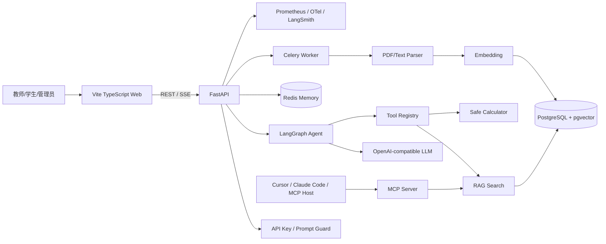

# EduAgent Hub

面向高校教学、教务与科研知识场景的实战级 **AI Agent + RAG 应用平台**。项目覆盖招聘中常见的：大模型 API 接入、Prompt 与结构化输出、LangGraph Agent、RAG、工具调用、MCP、会话记忆、异步任务、流式响应、评估、可观测性、Docker 与 CI/CD。

项目不是单纯堆砌技术名词，而是实现一条完整业务链路：

> 教师或管理员上传学校制度、课程资料和实验室文档，系统完成解析、切分、向量化和混合检索；学生通过多轮对话提问，Agent 根据意图选择知识库或计算工具，并返回带来源引用的答案。

## 一、招聘要求映射

| 招聘关键词 | 本项目实现 |
|---|---|
| 大模型 API 接入 | Chat 与 Embedding Provider 独立配置，可组合 DeepSeek Chat、OpenAI-compatible Embedding 或本地确定性 Embedding |
| Prompt 设计 | 角色、租户边界、拒答原则、引用规则、工具白名单 |
| 结构化输出 | Pydantic `IntentResult` + `with_structured_output` |
| Agent | LangGraph 状态图、ToolNode、条件路由、循环调用、流式事件 |
| RAG | PDF/TXT/Markdown 解析、递归切块、Embedding、pgvector、全文检索、RRF |
| 多轮对话 | Redis 保存短期会话记忆 |
| 外部系统联通 | MCP Server 暴露知识检索、计算和健康检查工具 |
| 异步任务 | Celery + Redis 处理文档解析与索引 |
| 测试评估 | pytest、离线 JSONL 回归集、引用率和延迟统计 |
| 上线交付 | Docker Compose、GitHub Actions、Prometheus、OpenTelemetry 接入点 |
| 前后端开发 | FastAPI + Vite TypeScript + SSE |

## 二、架构



## 三、核心技术设计

### 1. LangGraph Agent

Agent 不是“一次 Prompt 调用”，而是一个可控状态机：

1. 从 Redis 加载当前 `session_id` 的历史消息。
2. 进行输入长度和提示注入检测。
3. 按 `workspace_id` 预检索知识上下文。
4. 模型判断是否调用 `search_knowledge` 或 `safe_calculator`。
5. ToolNode 执行白名单工具并把结果写回状态。
6. 模型综合工具结果生成答案。
7. 保存会话并通过 SSE 输出事件。

### 2. 混合 RAG

单纯向量检索容易漏掉课程编号、制度条款、姓名等精确关键词，因此同时实现：

- pgvector cosine distance 向量召回；
- PostgreSQL `tsvector` 全文召回，并用 `pg_trgm` 补充中文和模糊关键词匹配；
- Chat 模型与 Embedding 服务分离配置，避免将模型提供商地址误作前端后端地址；
- Reciprocal Rank Fusion 合并两路排名；
- API Key 可绑定固定 `workspace_id`，检索 SQL 再执行租户过滤；
- 返回 `document_id`、`source`、`chunk_id` 和分数。

### 3. MCP

MCP Server 通过 `DEFAULT_WORKSPACE_ID` 固定到单个租户，避免模型通过工具参数选择其他 workspace。通过 Python MCP SDK/FastMCP 暴露：

- `search_knowledge`
- `safe_calculator`
- `platform_health`

这使知识检索和业务能力可以被 Cursor、Claude Code 或其他 MCP Host 标准化调用。

### 4. 安全与可靠性

- Agent 工具通过闭包绑定当前租户；API Key 可映射固定 workspace，防止请求切换租户；
- 工具白名单；
- 不使用 Python `eval()`，通过 AST 实现安全计算器；
- 文档入库以 `workspace_id + document_id` 为幂等边界；
- Celery 自动重试、晚确认、单任务超时；
- LLM 超时与重试；
- 知识不足时拒绝编造；
- Redis/PostgreSQL 不可用时提供内存降级，便于本地演示与 CI。

## 四、目录

```text
ai-agent-platform/
├── app/
│   ├── main.py
│   ├── config.py
│   ├── schemas.py
│   ├── prompts.py          # 可版本化、可审计的系统 Prompt
│   ├── llm.py
│   ├── rag.py
│   ├── agent.py
│   ├── tasks.py
│   └── mcp_server.py
├── frontend/
│   ├── src/main.ts
│   ├── src/style.css
│   └── Dockerfile
├── migrations/init.sql
├── scripts/evaluate.py
├── datasets/eval.jsonl
├── tests/
├── docs/
├── docker-compose.yml
├── Dockerfile
├── pyproject.toml
└── .env.example
```

## 五、快速启动

### Docker Compose

```bash
cp .env.example .env
docker compose up --build
```

访问：

- 前端：`http://localhost:5173`
- API：`http://localhost:8000`
- Swagger：`http://localhost:8000/docs`
- Prometheus：`http://localhost:8000/metrics`

默认 `MOCK_LLM=true`，不需要模型 Key。该模式可以完成入库、检索、引用、接口和前端演示，但不会产生真实大模型推理。

正式部署应启用 API Key，并把 Key 绑定到固定 workspace：

```env
API_KEYS=demo-key
API_KEY_WORKSPACES=demo-key:demo
```

### 接入真实模型

模型提供商密钥只允许配置在服务器 `.env` 中。浏览器“连接设置”填写的是 EduAgent Hub 后端地址与项目访问密钥，不是模型地址和模型 Key。

DeepSeek Chat + 本地演示 Embedding：

```bash
cp .env.deepseek.example .env
```

```env
API_KEYS=demo
API_KEY_WORKSPACES=demo:demo

MOCK_LLM=false
LLM_PROVIDER=deepseek
LLM_API_KEY=your-deepseek-key
LLM_BASE_URL=https://api.deepseek.com
LLM_MODEL=deepseek-v4-flash
LLM_THINKING_ENABLED=false

MOCK_EMBEDDINGS=true
```

前端连接设置：

```text
EduAgent API Base = http://服务器IP:8000
项目访问密钥       = demo
```

需要接入真实 Embedding 服务时，再独立配置：

```env
MOCK_EMBEDDINGS=false
EMBEDDING_API_KEY=your-embedding-key
EMBEDDING_BASE_URL=https://your-embedding-provider.example/v1
EMBEDDING_MODEL=text-embedding-3-small
```

> 数据库迁移默认使用 `VECTOR(1536)`。更换不同维度的 Embedding 模型时，需要同步修改 `EMBEDDING_DIMENSION` 和 `migrations/init.sql`。完整步骤见 `docs/DEEPSEEK_SETUP.md`。

## 六、本地开发

```bash
uv sync --all-extras
uv run uvicorn app.main:app --reload
```

Celery：

```bash
uv run celery -A app.tasks.celery_app worker -l INFO
```

前端：

```bash
cd frontend
npm install
npm run dev
```

## 七、主要接口

| 方法 | 路径 | 说明 |
|---|---|---|
| GET | `/health` | 服务健康检查 |
| GET | `/v1/platform/status` | 查看安全的模型/Embedding 配置状态，不返回密钥 |
| POST | `/v1/knowledge/text` | 文本切块、Embedding 与入库 |
| POST | `/v1/knowledge/files` | 上传 PDF/TXT/Markdown 并提交 Celery |
| GET | `/v1/tasks/{task_id}` | 查询异步任务状态 |
| GET | `/v1/knowledge/search` | 混合检索 |
| POST | `/v1/chat` | LangGraph Agent 对话 |
| POST | `/v1/chat/stream` | SSE 流式对话 |
| POST | `/v1/structured/intent` | Pydantic 结构化意图识别 |

## 八、MCP 启动

```bash
uv run python -m app.mcp_server
```

示例 MCP Host 配置：

```json
{
  "mcpServers": {
    "eduagent-hub": {
      "command": "uv",
      "args": [
        "--directory",
        "/absolute/path/to/ai-agent-platform",
        "run",
        "python",
        "-m",
        "app.mcp_server"
      ]
    }
  }
}
```

MCP STDIO 模式不能向标准输出随意打印日志，本项目日志写入标准错误流。

## 九、测试与评估

```bash
uv run pytest -q
uv run ruff check .
uv run mypy app
uv run python scripts/evaluate.py --dataset datasets/eval.jsonl
```

建议真实项目持续记录：

- Retrieval Hit@K
- Citation Rate
- Answer Keyword Recall
- P50/P95 latency
- Tool success rate
- Prompt injection rejection rate
- Token cost per successful task

## 十、常见连接错误

- 页面显示 `HTTP 401`：连接设置中的 X-API-Key 应填写 `.env` 的 `API_KEYS`，不能填写 DeepSeek Key。
- 页面显示 `HTTP 404`：API Base 很可能错误地填写成模型提供商地址，应改为 `http://服务器IP:8000`。
- 修改 `.env` 后没有生效：必须重新创建 API/Worker 容器：

```bash
docker-compose up -d --build --force-recreate api worker frontend
```

- 安全检查：

```bash
curl http://127.0.0.1:8000/v1/platform/status
```

## 十一、简历表述

**EduAgent Hub｜教育知识库与工作流智能体平台**

- 基于 FastAPI、LangGraph 与 OpenAI-compatible API 构建多轮 Agent，设计工具注册与状态化工作流，支持知识检索、结构化输出、SSE 流式响应和 Redis 会话记忆。
- 搭建 PostgreSQL + pgvector RAG 管线，完成 PDF 文档解析、递归切块、向量检索与全文检索，并使用 RRF 融合排序和来源引用提升回答可追溯性。
- 基于 MCP 封装知识检索与业务工具，实现 Agent 与外部系统的标准化联通；使用 Celery + Redis 异步处理大文件索引任务。
- 建立离线评估、Prometheus/OpenTelemetry 可观测接入及 Docker Compose、GitHub Actions 交付流程，支持模型、Prompt 和检索策略持续迭代。

## 十二、不要在面试中夸大的部分

当前仓库提供的是完整工程骨架和可运行 Demo。简历中不应声称已经拥有真实学校生产数据、百万级文档、线上高并发或大规模用户指标，除非后续确实进行了压测和真实部署。建议在完成真实模型接入后补充：

1. 50～100 篇公开制度/课程文档；
2. 30～50 条人工标注问答；
3. 不同切块、Top-K、混合检索权重的消融；
4. P95 延迟、引用率、检索命中率；
5. 一段完整录屏和部署地址。

详见 `docs/INTERVIEW.md` 与 `docs/ROADMAP.md`。
