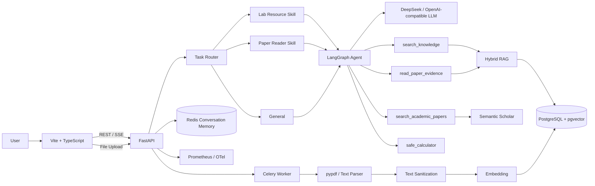
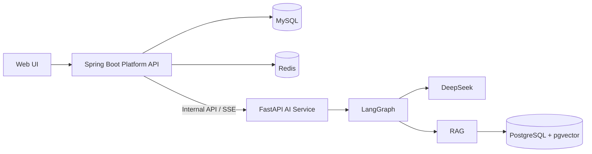

# EduAgent Hub

> 面向实验室知识管理与科研论文阅读的 **AI Agent + RAG 应用平台**  
> 当前阶段：V1 Agent/RAG 核心闭环已完成，V2 计划引入 Spring Boot 平台业务层。

GitHub: https://github.com/jmhngnl/EduAgent-Hub

---

## 项目简介

EduAgent Hub 是一个围绕 **Agent、RAG、Tool Calling、Skill Routing、论文阅读和知识库管理** 构建的 AI 应用工程。

它不只是一次大模型 API 调用，而是实现了一条完整链路：

```text
用户问题
   ↓
Task Router
   ↓
Skill Selection
   ↓
LangGraph Agent
   ↓
Tool Calling
   ↓
RAG / Academic Search
   ↓
DeepSeek
   ↓
SSE Streaming
   ↓
Route / Skill / Tool / Citation 可观测 UI
```

目前主要覆盖两类真实场景：

```text
实验室资源与内部知识
├── GPU / 算力申请
├── 服务器与 DBCloud 登录
├── 实验室制度与流程
└── 数据合规 / 脱敏

科研论文
├── PDF 上传与解析
├── 论文背景 / 方法 / 创新点
├── 数据集 / baseline / 指标
├── 消融实验 / 局限
└── Semantic Scholar 论文检索与推荐
```

---

# 1. 当前核心能力

| 能力 | 当前实现 |
|---|---|
| LLM | DeepSeek / OpenAI-compatible Chat Provider |
| Agent | LangGraph StateGraph + ToolNode + Tool Calling |
| Task Routing | `lab_resource / paper_reading / general` |
| Skill | `paper-reader`、`lab-resource` |
| 实验室 RAG | `search_knowledge`，限定 `lab_document` |
| 论文深度阅读 | `read_paper_evidence`，限定 `paper` |
| 论文检索 | Semantic Scholar |
| 文档类型隔离 | `document_type=lab_document / paper` |
| 文件上传 | PDF / TXT / Markdown |
| PDF 解析 | pypdf |
| 异步入库 | Celery + Redis |
| 向量检索 | PostgreSQL + pgvector |
| 关键词检索 | PostgreSQL FTS + pg_trgm |
| 排序融合 | Reciprocal Rank Fusion |
| 多轮记忆 | Redis |
| 流式输出 | SSE |
| Agent 可观测 | Route / Skill / Tool / Citation |
| 前端 | Vite + TypeScript |
| 部署 | Docker Compose |
| MCP | FastMCP / MCP Server |
| 测试 | pytest |
| 可观测性 | Prometheus / OpenTelemetry 接入点 |

---

# 2. 系统架构



---

# 3. Task Router

系统会在 Agent 调用模型之前先判断任务类型。

当前路由：

```text
lab_resource
paper_reading
general
```

例如：

```text
DBCloud 怎么登录？
```

路由结果：

```text
Task: 实验室资源任务
Skill: lab-resource
Tool: search_knowledge
```

论文请求：

```text
请分析 arxiv-2607-28565 的消融实验
```

路由结果：

```text
Task: 论文解读任务
Skill: paper-reader
Tool: read_paper_evidence
```

这一层的目标是防止：

```text
实验室文档
        ↕
学术论文
```

之间发生错误检索和上下文污染。

---

# 4. Skill 系统

## 4.1 Paper Reader

位置：

```text
skills/paper-reader/SKILL.md
```

主要任务：

- 论文背景与研究动机；
- 方法 / 模块 / Architecture；
- 创新点；
- 数据集；
- baseline；
- quantitative results；
- ablation；
- limitation；
- 论文推荐。

主要 Tools：

```text
read_paper_evidence
search_academic_papers
```

---

## 4.2 Lab Resource

位置：

```text
skills/lab-resource/SKILL.md
```

主要任务：

- GPU / 算力资源申请；
- 实验室服务器；
- DBCloud；
- 账号与登录；
- 内部审批流程；
- 数据合规与脱敏；
- 实验室制度。

主要 Tool：

```text
search_knowledge
```

---

# 5. Agent Tool Calling

当前 Agent Tool Registry：

```text
search_knowledge
search_academic_papers
read_paper_evidence
safe_calculator
```

### search_knowledge

针对实验室、制度、业务类文档。

```text
document_type = lab_document
```

---

### read_paper_evidence

根据论文：

```text
document_id
```

执行多组定向查询：

```text
背景 / motivation
方法 / architecture / loss
数据集 / baseline / metrics / results
ablation / limitations / conclusion
```

并聚合论文证据。

```text
document_type = paper
```

---

### search_academic_papers

通过 Semantic Scholar 搜索论文元信息和摘要。

适合：

```text
论文发现
论文推荐
相关工作搜索
```

不将论文搜索摘要冒充为已上传 PDF 的实验数据证据。

---

### safe_calculator

使用 AST 实现受限算术表达式计算，不执行：

```python
eval()
```

---

# 6. Agent 执行轨迹可观测

前端会显示本轮 Agent 的：

```text
任务类型
Skill
Tools
```

例如：

```text
任务：实验室资源任务
Skill：lab-resource
Tools：实验室知识检索
```

论文：

```text
任务：论文解读任务
Skill：paper-reader
Tools：论文证据读取
```

流式 SSE 事件：

```text
route
tool_start
token
tool_end
done
```

因此用户可以看到：

```text
Router 做了什么
Skill 选了什么
Agent 实际调用了哪个 Tool
```

而不只是看到最终大模型回答。

---

# 7. Typed Knowledge Base

实验室资料和科研论文共用知识表，但通过 metadata 做内容类型隔离。

```json
{
  "document_type": "lab_document"
}
```

或者：

```json
{
  "document_type": "paper"
}
```

设计含义：

```text
workspace
= 租户 / 权限边界

document_type
= 内容分类边界
```

旧文档如果没有 `document_type`：

```text
默认视为 lab_document
```

---

# 8. Hybrid RAG

EduAgent Hub 不是单一向量检索。

当前使用：

```text
Vector Search
+
Full Text Search
+
pg_trgm
+
RRF
```

流程：

```text
Query
 ├── pgvector cosine recall
 └── PostgreSQL lexical recall
          ↓
 Reciprocal Rank Fusion
          ↓
 Top-K Context
```

返回：

```text
document_id
source
chunk_id
score
content
metadata
```

---

# 9. PDF 异步入库

支持：

```text
PDF
TXT
Markdown
```

流程：

```text
Frontend
   ↓
FastAPI
   ↓
uploads volume
   ↓
Celery + Redis
   ↓
pypdf
   ↓
text sanitization
   ↓
RecursiveCharacterTextSplitter
   ↓
Embedding
   ↓
PostgreSQL + pgvector
```

API 与 Worker 共享：

```text
uploads:/tmp/eduagent_uploads
```

---

# 10. PDF NUL 字符故障修复

真实论文测试中发现：

```text
pypdf.extract_text()
```

有可能产生：

```text
\x00
```

PostgreSQL UTF-8 `text` 不允许 NUL 字符，因此会出现：

```text
asyncpg.exceptions.CharacterNotInRepertoireError:
invalid byte sequence for encoding "UTF8": 0x00
```

目前在 Knowledge Store 持久化边界统一执行文本清洗。

因此：

```text
PDF
TXT
Markdown
手工文本
```

都会受到统一保护。

一次真实测试：

```text
PDF pages: 14
Extracted chars: 77,681
NUL chars: 5
Indexed chunks: 117
Final status: SUCCESS
```

---

# 11. 前端能力

当前 Web UI 支持：

### Knowledge Base

```text
文档类型
├── 实验室文档
└── 学术论文

文本入库
文件上传
文档列表
chunk count
```

### Agent Chat

```text
SSE Streaming
Route Trace
Skill Trace
Tool Trace
Citation
```

### 长对话 UI

Agent 对话区域使用固定可调整高度。

```text
默认高度：560px
最小高度：320px
最大高度：900px / 78vh
```

底部拖拽条：

```text
拖动
→ 调整聊天区域高度

双击
→ 恢复默认高度
```

高度保存：

```text
localStorage.eduagentChatHeight
```

消息区域内部滚动，不再因为长论文回答把整个页面撑到几千像素。

---

# 12. 当前技术栈

## AI / Backend

```text
Python 3.12
FastAPI
LangGraph
LangChain
DeepSeek
Semantic Scholar
pypdf
```

## Data / Retrieval

```text
PostgreSQL 17
pgvector
PostgreSQL FTS
pg_trgm
RRF
```

## Async / Memory

```text
Celery
Redis
```

## Frontend

```text
TypeScript
Vite
Nginx
SSE
```

## Engineering

```text
Docker
Docker Compose
pytest
Prometheus
OpenTelemetry
GitHub Actions
MCP
```

---

# 13. 项目目录

```text
EduAgent-Hub/
├── app/
│   ├── agent.py
│   ├── config.py
│   ├── llm.py
│   ├── main.py
│   ├── mcp_server.py
│   ├── prompts.py
│   ├── rag.py
│   ├── schemas.py
│   ├── tasks.py
│   │
│   ├── skills/
│   │   └── registry.py
│   │
│   └── tools/
│       └── paper_search.py
│
├── skills/
│   ├── paper-reader/
│   │   └── SKILL.md
│   └── lab-resource/
│       └── SKILL.md
│
├── frontend/
│   ├── src/
│   │   ├── main.ts
│   │   └── style.css
│   └── Dockerfile
│
├── migrations/
├── datasets/
├── scripts/
├── tests/
├── docs/
├── docker-compose.yml
├── Dockerfile
├── pyproject.toml
└── README.md
```

---

# 14. 快速启动

## 14.1 环境文件

```bash
cp .env.deepseek.example .env
```

浏览器里的：

```text
X-API-Key
```

是 EduAgent Hub 项目访问密钥。

模型 Secret：

```text
LLM_API_KEY
```

只能保存在服务器 `.env`。

---

## 14.2 DeepSeek 配置示例

```env
API_KEYS=demo
API_KEY_WORKSPACES=demo:demo

MOCK_LLM=false
LLM_PROVIDER=deepseek
LLM_API_KEY=your-deepseek-api-key
LLM_BASE_URL=https://api.deepseek.com
LLM_MODEL=deepseek-v4-flash
LLM_THINKING_ENABLED=false

MOCK_EMBEDDINGS=true
```

> 不要把真实模型 API Key 提交到 Git。

---

## 14.3 Docker Compose

新版 Docker：

```bash
docker compose up -d --build
```

旧版 Docker Compose：

```bash
docker-compose up -d --build
```

访问：

```text
Frontend:
http://localhost:5173

FastAPI:
http://localhost:8000

Swagger:
http://localhost:8000/docs

Metrics:
http://localhost:8000/metrics
```

---

# 15. 知识库 API

## 文本入库

```http
POST /v1/knowledge/text
```

## 文件上传

```http
POST /v1/knowledge/files
```

支持：

```text
.pdf
.txt
.md
.markdown
```

## 异步任务状态

```http
GET /v1/tasks/{task_id}
```

## 混合检索

```http
GET /v1/knowledge/search
```

## 文档列表

```http
GET /v1/knowledge/documents
```

可指定：

```text
document_type=lab_document
document_type=paper
```

---

# 16. Agent API

普通请求：

```http
POST /v1/chat
```

流式请求：

```http
POST /v1/chat/stream
```

SSE：

```text
route
tool_start
token
tool_end
done
```

---

# 17. Paper Reader 示例

先上传论文：

```bash
curl -X POST \
  "http://127.0.0.1:8000/v1/knowledge/files" \
  -H "X-API-Key: demo" \
  -F "file=@paper.pdf;type=application/pdf" \
  -F "workspace_id=demo" \
  -F "document_id=my-paper" \
  -F "document_type=paper"
```

然后问：

```text
请读取 document_id=my-paper，
分析论文的：

1. 研究背景
2. 核心创新
3. 方法结构
4. 数据集
5. baseline
6. 定量指标
7. 消融实验
8. 局限

数字必须来自论文证据。
```

---

# 18. Lab Resource 示例

实验室文档入库后：

```text
DBCloud 怎么登录？
```

Agent：

```text
Task Router
→ lab_resource

Skill
→ lab-resource

Tool
→ search_knowledge

RAG
→ document_type=lab_document
```

---

# 19. MCP

启动：

```bash
python -m app.mcp_server
```

当前可对外暴露知识检索、计算和平台健康检查等能力。

MCP 主要用于：

```text
Cursor
Claude Code
其他 MCP Host
```

与 EduAgent Hub 的工具层标准化联通。

---

# 20. 测试

如果本地已经安装 dev dependencies：

```bash
pytest -q
```

Docker 临时测试：

```bash
docker-compose run --rm --user root \
  -v "$PWD:/srv/eduagent" \
  api sh -lc '
python -m pip install \
  "pytest>=8.3,<9" \
  "pytest-asyncio>=0.25,<1" &&
python -m pytest -q
'
```

重点回归：

```text
RAG
workspace isolation
document type
Paper Skill
Task Router
PDF text sanitization
API
security
```

---

# 21. 当前 V1 已完成闭环

```text
Knowledge Upload
      ↓
Async Parsing
      ↓
Typed Knowledge Base
      ↓
Hybrid RAG
      ↓
Task Router
      ↓
Skill Selection
      ↓
LangGraph Tool Calling
      ↓
DeepSeek
      ↓
SSE
      ↓
Observable Agent UI
```

---

# 22. 当前仍存在的工程缺口

虽然 AI 核心链路已经完整，但当前仍属于 V1：

```text
缺少真实 User 系统
缺少 Conversation 持久化
缺少历史对话 Sidebar
缺少 Workspace Membership / RBAC
缺少完整文档生命周期
缺少上传用户 / 创建时间 / 版本 / 删除 / 重索引
浏览器仍直接访问 FastAPI
```

因此下一阶段重点不是继续堆更多模型，而是增加真实平台业务层。

---

# 23. V2：Java + Python 双后端

下一阶段计划引入：

```text
Java 17
Spring Boot 3
MyBatis-Plus
MySQL 8
Redis
```

但不会重写 LangGraph AI 核心。

目标架构：



职责：

### Spring Boot

```text
User
JWT
Workspace
RBAC
Conversation
ChatMessage
Document metadata
Task status
Audit
Business API
```

### FastAPI / Python

```text
LangGraph
Task Router
Skill
Tool
LLM
Paper Reader
RAG
Embedding
PDF Parsing
```

---

# 24. V2 第一阶段：Conversation Persistence

优先实现：

```text
conversation
chat_message
```

MySQL 作为历史对话 Source of Truth。

目标体验：

```text
+ 新建对话

今天
├── MIND 论文分析
├── GPU 资源申请
└── DBCloud 登录

昨天
├── Flow Matching 论文推荐
└── 实验室制度
```

刷新网页：

```text
历史会话仍然存在
```

点击会话：

```text
恢复 User Message
恢复 Assistant Message
恢复 Route
恢复 Skill
恢复 Tool Calls
恢复 Citations
```

Redis 继续承担最近上下文缓存，而不是永久历史存储。

---

# 25. 后续平台化路线

建议按顺序演进：

```text
V2.1
Spring Boot + MySQL Conversation

V2.2
JWT + Redis + User / Workspace / RBAC

V2.3
Java BFF → Python Internal AI Service

V2.4
Document lifecycle

V2.5
MinIO / COS

V2.6
RabbitMQ document events

V2.7
Audit / Rate Limit / Observability / CI-CD
```

暂时不急着引入：

```text
Spring Cloud
Nacos
Kafka
Kubernetes
```

避免为了技术栈数量增加不必要复杂度。

---

# 26. 项目价值

这个项目希望体现的不是：

```text
“会调用一个大模型 API”
```

而是完整 AI 应用工程能力：

```text
业务任务识别
+
Agent Orchestration
+
Skill / Tool
+
RAG
+
数据隔离
+
异步文档处理
+
多轮会话
+
流式 UI
+
可观测性
+
Docker 部署
+
后续 Java 平台工程化
```

---

# 27. 安全说明

请勿提交：

```text
.env
真实 LLM_API_KEY
真实第三方 Secret
*.patch
本地测试 PDF
```

仓库 `.gitignore` 已忽略：

```text
.env
*.patch
*.diff
*.rej
*.orig
/*.pdf
```

生产环境应进一步使用：

```text
Secret Manager
环境变量注入
内部网络
RBAC
审计日志
```

---

# 28. 项目状态

当前阶段：

```text
V1 Agent / RAG Core: ✅

Typed Knowledge Base: ✅
PDF Async Ingestion: ✅
Paper Reader: ✅
Lab Resource Skill: ✅
Task Router: ✅
Tool Calling: ✅
Agent Trace UI: ✅
Resizable Chat UI: ✅

Persistent Conversation History: ⏳
Java Platform Backend: ⏳
User / Workspace / RBAC: ⏳
Document Lifecycle: ⏳
```

下一阶段：

> **从可运行的 AI Agent Demo，升级为 Java + Python 双后端的真实 AI 应用平台。**
